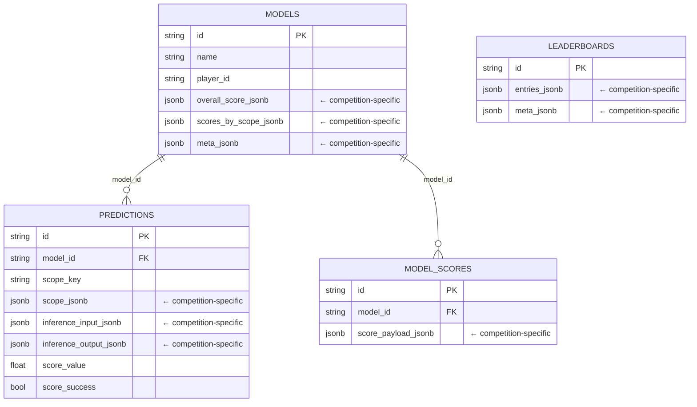
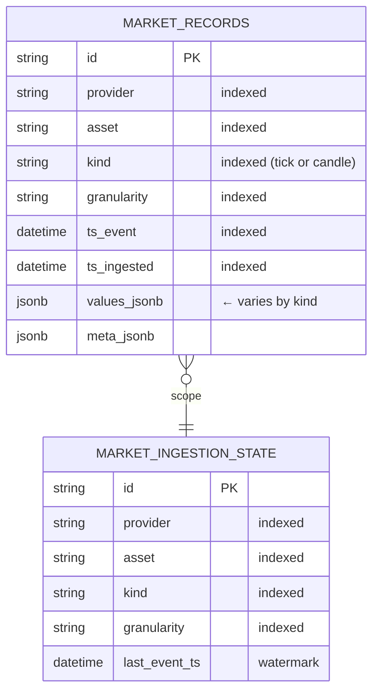
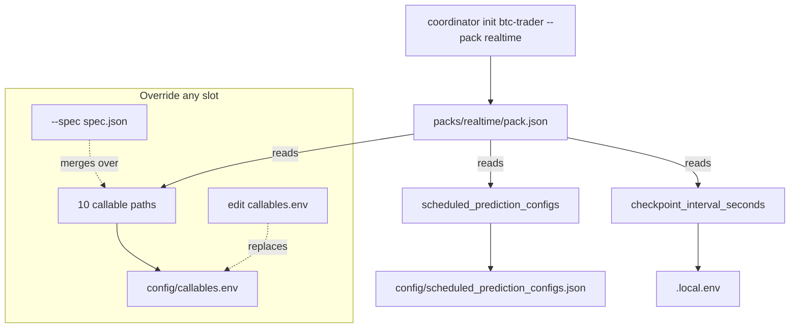
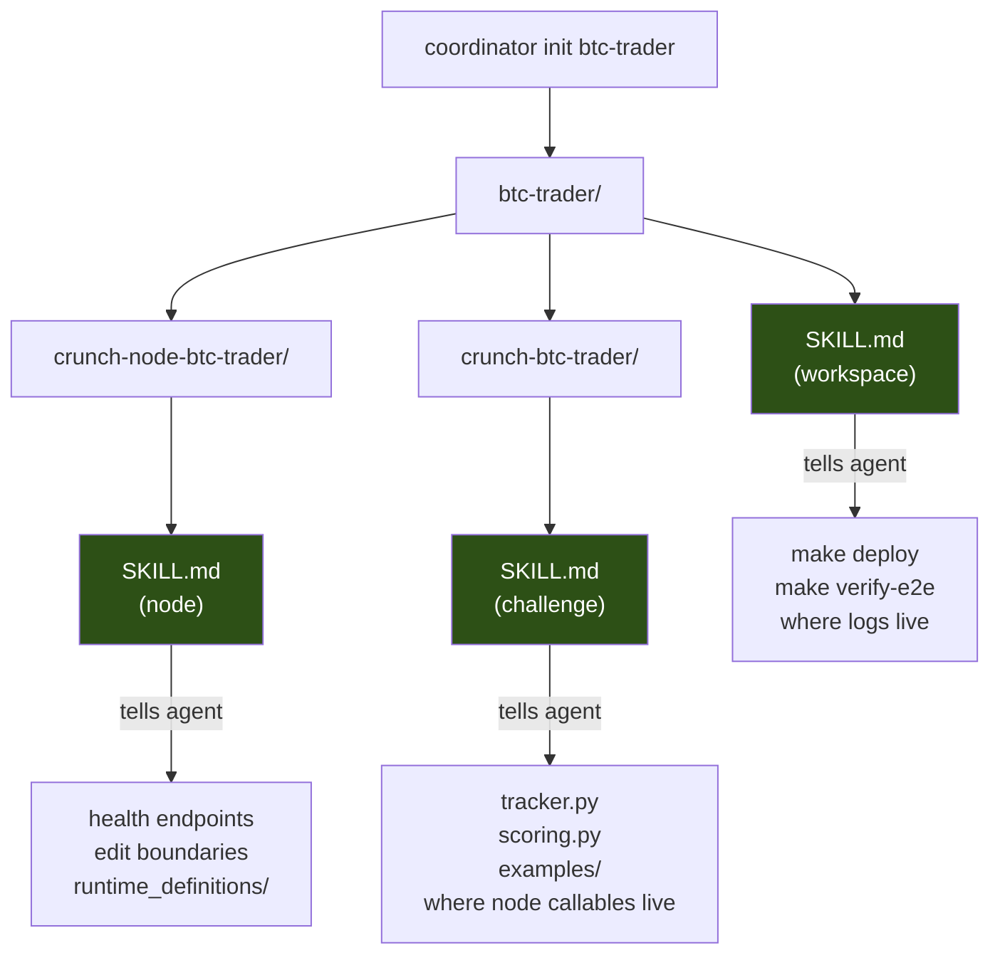
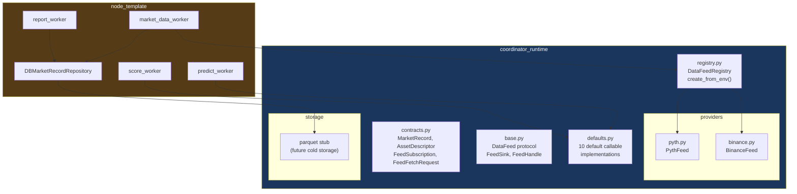
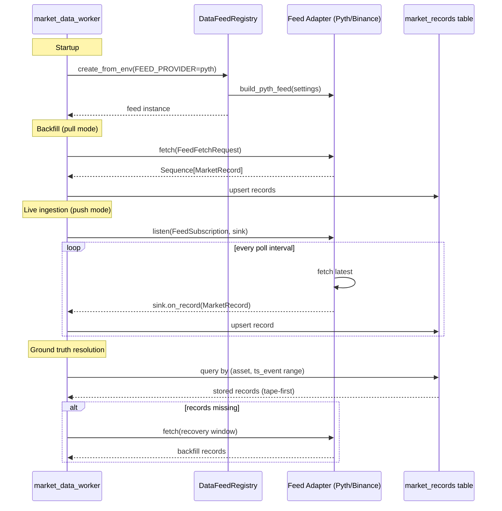
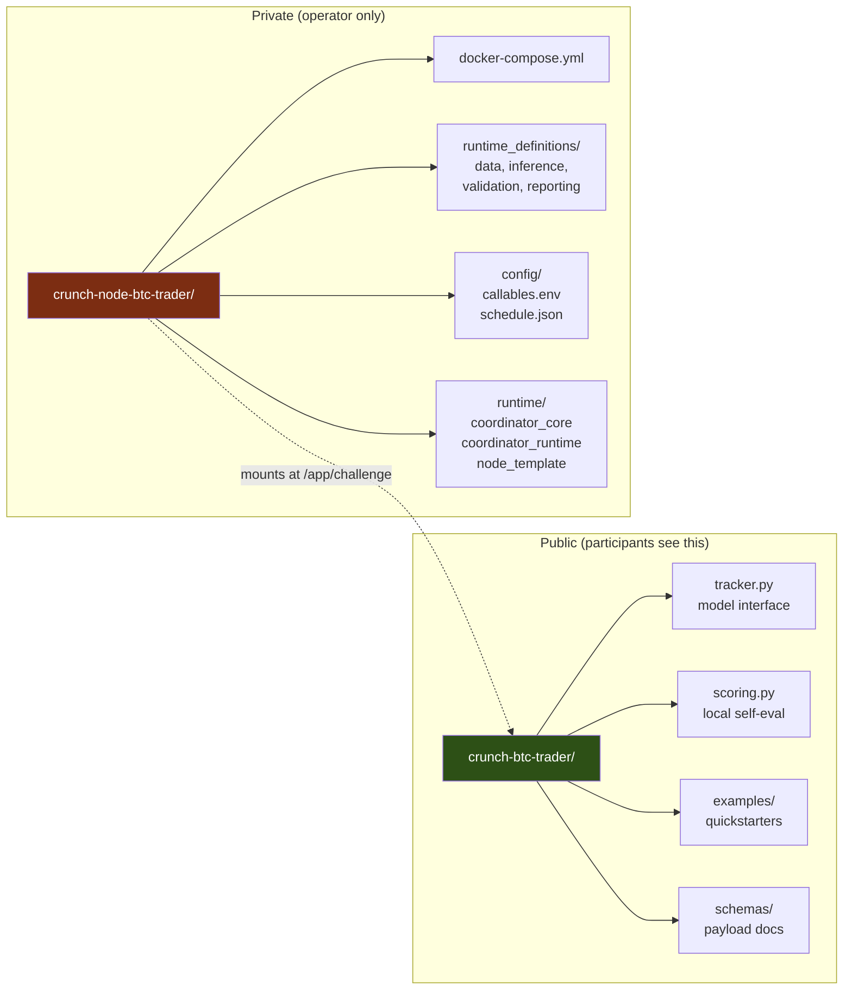
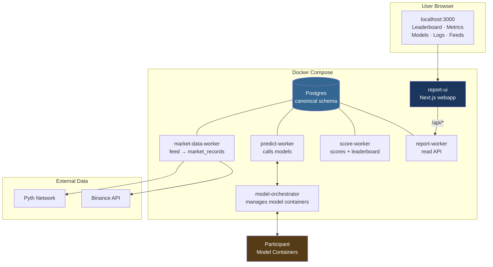

# Architecture & Design Principles

## Overview

The coordinator-node-starter is a template system for building competition coordinators ("Crunches"). Each coordinator runs a predict → score → rank loop against participant models, fed by live market data.

The architecture is built on five core principles:

1. Canonical schema with JSONB extension
2. Deterministic callable wiring via packs
3. Generated skill files that guide LLM agents
4. Shared runtime library (`coordinator_runtime`)
5. Two-repo separation per competition

---

## 1. Canonical Schema + JSONB Extension

Every coordinator shares the same Postgres table structure. Protocol-required columns are typed and indexed. Competition-specific data lives in JSONB columns.



The key insight: **typed columns for protocol queries, JSONB columns for competition-specific payloads**.

```
┌──────────────────────────────────────────────────────────────────┐
│                     Same canonical tables                        │
│                                                                  │
│  ┌─────────────┐   ┌─────────────┐   ┌─────────────┐           │
│  │ BTC Price   │   │ NLP         │   │ Portfolio    │           │
│  │ Predictor   │   │ Sentiment   │   │ Optimizer    │           │
│  │             │   │             │   │              │           │
│  │ scope_jsonb:│   │ scope_jsonb:│   │ scope_jsonb: │           │
│  │ {asset,     │   │ {corpus,    │   │ {universe,   │           │
│  │  horizon}   │   │  window}    │   │  rebalance}  │           │
│  └─────────────┘   └─────────────┘   └─────────────┘           │
│                                                                  │
│  Zero schema migrations. Same queries. Different payloads.       │
└──────────────────────────────────────────────────────────────────┘
```

Separately, `market_records` is a **high-volume append table** for raw market data. Each data point is its own row with typed/indexed columns for querying (`provider`, `asset`, `kind`, `granularity`, `ts_event`). JSONB is only used for the per-record value shape, which varies by data kind:



```
 tick row:   values_jsonb = {"price": 44987.5}
 candle row: values_jsonb = {"open": 45000, "high": 45010, "low": 44980, "close": 44992, "volume": 12.3}
```

This is not a JSONB-array-per-feed design. One row per data point, uniquely indexed on `(provider, asset, kind, granularity, ts_event)` for dedup and fast time-range queries.

This means:

- **New competitions don't require schema migrations.** A BTC price predictor and an NLP sentiment ranker use the same tables — they just put different shapes inside the JSONB columns.
- **Core queries work everywhere.** Filtering predictions by model, time range, or scope works identically regardless of what's inside the payloads.
- **The webapp, CLI tools, and report APIs work against known column names** while competition-specific UI (column labels, metric widgets) reads from configurable schema endpoints.

The canonical tables are defined once in `coordinator_core/infrastructure/db/db_tables.py` and shared across all generated workspaces via vendoring.

---

## 2. Deterministic Callable Wiring via Packs

A coordinator's behavior is defined by **ten callable slots** that form the full predict → score → rank pipeline:

```mermaid
flowchart LR
    subgraph "Data Ingestion"
        RAW[RAW_INPUT_PROVIDER]
    end

    subgraph "Prediction Pipeline"
        INP[INFERENCE_INPUT_BUILDER]
        SCOPE[PREDICTION_SCOPE_BUILDER]
        CALL[PREDICT_CALL_BUILDER]
        VAL[INFERENCE_OUTPUT_VALIDATOR]
    end

    subgraph "Scoring Pipeline"
        GT[GROUND_TRUTH_RESOLVER]
        SCORE[SCORING_FUNCTION]
        AGG[MODEL_SCORE_AGGREGATOR]
        RANK[LEADERBOARD_RANKER]
    end

    subgraph "Reporting"
        SCHEMA[REPORT_SCHEMA_PROVIDER]
    end

    RAW --> INP --> SCOPE --> CALL --> VAL
    VAL --> GT --> SCORE --> AGG --> RANK
    RANK --> SCHEMA
```



| Slot | Responsibility |
|------|---------------|
| `RAW_INPUT_PROVIDER` | Fetch/build the raw data payload for a prediction cycle |
| `INFERENCE_INPUT_BUILDER` | Transform raw input into what models receive |
| `INFERENCE_OUTPUT_VALIDATOR` | Validate model responses |
| `SCORING_FUNCTION` | Score a single prediction against ground truth |
| `GROUND_TRUTH_RESOLVER` | Resolve what actually happened (from market tape or external source) |
| `MODEL_SCORE_AGGREGATOR` | Aggregate per-prediction scores into per-model scores |
| `LEADERBOARD_RANKER` | Rank models into a leaderboard snapshot |
| `REPORT_SCHEMA_PROVIDER` | Define the leaderboard column / metrics widget schema for the UI |
| `PREDICTION_SCOPE_BUILDER` | Build the scope dimensions for each prediction |
| `PREDICT_CALL_BUILDER` | Assemble the final model invocation payload |

**Packs** are JSON manifests that pre-wire all ten slots:



Available packs:

- **baseline** — 60s cycles, balanced local development
- **realtime** — 15s cycles, low-latency tournament
- **tournament** — combined in-sample + out-of-sample scopes

Callable paths use Python dotted-module notation (`runtime_definitions.data:provide_raw_input`). Workers load them at startup via `importlib`, so no code changes are needed to swap behavior — just change the env var.

---

## 3. Generated Skill Files (LLM Agent Guidance)

Every scaffolded workspace includes three `SKILL.md` files — structured instructions for coding agents:



The idea: `coordinator init` produces the hard 80% (working infrastructure, wired callables, running stack). The SKILL files prompt an LLM to fill in the remaining 20% — the actual competition logic — by pointing it at the right files and explaining the constraints.

---

## 4. Shared Runtime Library (`coordinator_runtime`)

Code that is **common across all coordinators** lives in `coordinator_runtime/`:



### Feed Architecture

Provider adapters implement a dual-mode protocol:



Provider adapters prefer SDK packages (e.g. `python-binance`) for external connections, with HTTP fallback if the package is unavailable.

### Tape-First Pattern

```
┌─────────────────────────────────────────────────────┐
│                  Ground Truth Resolution             │
│                                                      │
│   1. Query market_records for (asset, time window)   │
│              │                                       │
│              ▼                                       │
│        Records found? ──yes──► Use stored values     │
│              │                                       │
│              no                                      │
│              │                                       │
│              ▼                                       │
│   2. Fetch from live feed (recovery)                 │
│              │                                       │
│              ▼                                       │
│   3. Store fetched records for future queries        │
│              │                                       │
│              ▼                                       │
│        Return resolved ground truth                  │
│                                                      │
│   TTL retention based on market time (ts_event)      │
│   not ingest time                                    │
└─────────────────────────────────────────────────────┘
```

---

## 5. Two-Repo Separation

Each competition produces two repositories with a clear visibility boundary:



| Repo | Visibility | Contains |
|------|-----------|----------|
| `crunch-<name>` | **Public** | Model interface (`tracker.py`), scoring logic, quickstarter examples, schemas |
| `crunch-node-<name>` | **Private** | Deployment config, callable wiring, runtime definitions, vendored runtime packages |

This separation means participants see only the challenge contract — not the infrastructure, scoring weights, or data pipeline internals.

The node workspace is self-contained: it vendors `coordinator_core`, `coordinator_runtime`, and `node_template` into a `runtime/` directory and builds a single Docker image from them. No dependency on the template repo at runtime.

---

## How It Fits Together

### Scaffold Output

```
coordinator init btc-trader --pack realtime
│
├─ reads pack JSON (callables, schedule, checkpoint interval)
├─ renders templates (Dockerfile, docker-compose, Makefile, SKILL files)
├─ generates .local.env + config/callables.env with all 10 slots wired
├─ vendors coordinator_core + coordinator_runtime + node_template
│
└─ btc-trader/
   ├─ SKILL.md                       ← workspace agent guidance
   ├─ process-log.jsonl              ← scaffold audit trail
   │
   ├─ crunch-btc-trader/             ← public challenge package
   │  ├─ SKILL.md                    ← challenge agent guidance
   │  ├─ crunch_btc_trader/
   │  │  ├─ tracker.py               ← model interface (fill this in)
   │  │  ├─ scoring.py               ← scoring function (fill this in)
   │  │  └─ examples/                ← quickstarters for participants
   │  └─ pyproject.toml
   │
   └─ crunch-node-btc-trader/        ← private node runtime
      ├─ SKILL.md                    ← node agent guidance
      ├─ RUNBOOK.md                  ← troubleshooting guide
      ├─ docker-compose.yml          ← all services pre-wired
      ├─ Dockerfile
      ├─ Makefile                    ← deploy/verify/logs targets
      ├─ .local.env                  ← environment config
      ├─ runtime_definitions/        ← node-private callables
      │  ├─ data.py                  ← tape-first input + ground truth
      │  ├─ inference.py             ← input builder
      │  ├─ validation.py            ← output validator
      │  └─ reporting.py             ← UI schema
      ├─ config/
      │  ├─ callables.env            ← all 10 callable paths
      │  └─ scheduled_prediction_configs.json
      └─ runtime/                    ← vendored packages
         ├─ coordinator_core/
         ├─ coordinator_runtime/
         └─ node_template/
```

### Running Stack



---

## Key Design Decisions

| Decision | Rationale |
|----------|-----------|
| JSONB for all competition-specific data | No migrations per competition. Same queries, different payloads. |
| Ten callable slots, not plugin classes | Simple to reason about. One function per concern. Swappable via env. |
| Packs, not inheritance | Flat JSON config. No class hierarchies. Easy to diff and override. |
| Tape-first ground truth | Deterministic scoring from stored data. Feed failures don't block scoring. |
| Vendor at scaffold time | Node workspace works offline. No implicit dependency on template repo. |
| Generated SKILL files | Agents get structured guidance, not just code. The scaffold is documentation. |
| SDK-first for external APIs | Explicit, testable dependencies. HTTP fallback for resilience. |
| Feed visibility in UI is data-driven | Feeds nav appears only when feed data exists. Zero config for the operator. |
