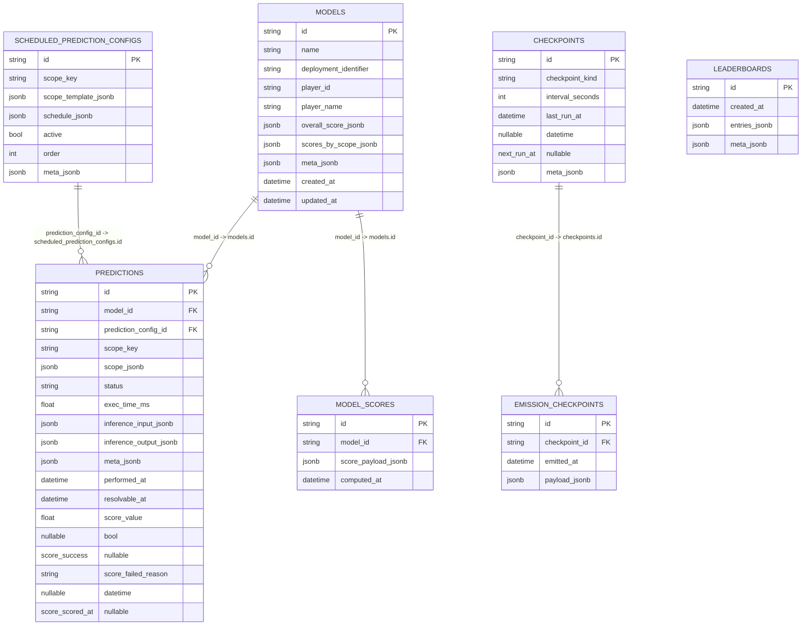

# Database Schema (Canonical)

This document reflects the current canonical SQLModel schema in:

- `coordinator_core/infrastructure/db/db_tables.py`

## ER Diagram

## Notes

- Challenge-specific shapes are carried in JSONB (`*_jsonb`) and typed in application code.
- `scope_key` + `scope_jsonb` are generic prediction dimensions.
- `model_scores.score_payload_jsonb` is the canonical per-model score envelope/payload container.
- `leaderboards.entries_jsonb` remains snapshot-oriented and denormalized by design.
